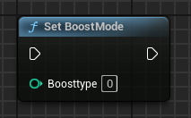
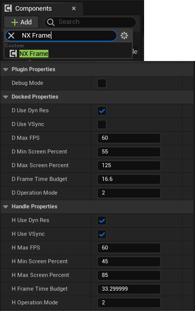

# UE_NXUtilities
A small plugin to add some part of the NX Librairie to UE Blueprints

## Node Showcase
Here the differents nodes available with this plugin:

Use "Set BoostMode" to overclock the CPU and Underclock the GPU to make loading faster.

And the differents names of each nodes: 

And now there is a Component for the Dock / Handle mode that change the Settings when you switch between them.

## Example Project

Find the example project in the Example folder.
[]

## How to Install

Installation in the Engine - You can put the plugin in the engine in this directory : "UE_5.3/Engine/Plugins/GitHub"
(You will need to create a sub-folder "GitHub" in the Plugin folder)

Installation for a project - Open your project file and create a folder named "Plugins" and put the extracted plugin inside.

